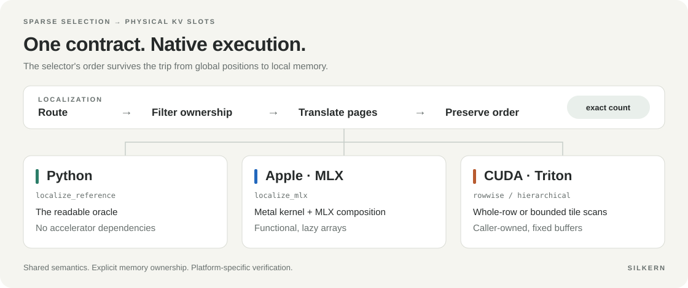

<div align="center">


**Order, woven in.**

Deterministic sparse-index localization for **Apple silicon / MLX** and **CUDA / Triton**.

[](https://github.com/StevenWang-CY/SILKern./actions/workflows/ci.yml)
[](pyproject.toml)
[](LICENSE)
[](evidence/)

[Get started](#get-started) · [Apple / MLX](docs/apple-mlx.md) · [Use in attention](docs/consuming-indices.md) · [Performance](#performance-with-context) · [Contract](docs/contract.md)

</div>



**Figure 1. From global positions to stable cache addresses.** (a) Rank 0 keeps tokens 8, 130, and 262 and deinterleaves them to local positions 4, 65, and 131. (b) The page table translates these to physical slots 708, 129, and 451. (c) Prefix destinations 0, 1, and 2 preserve selector order; the remaining columns are padding and the count is 3. Only valid destinations are shown. Color tracks each survivor. This worked row uses two ranks, interleave 1, page size 64, and request 0; all retained mappings are in range. K/V gathering remains a consumer operation.

**New in 0.2.0 (unreleased):** native Apple/MLX localization, backend-specific
verification, stronger validation, and an explicit architecture guide.
[See the changelog](CHANGELOG.md).

## A small kernel at an important boundary

Sparse attention selects global token positions. A rank in context-parallel
attention needs physical slots in its own paged KV cache. SILKern performs that
translation, filters ownership, and preserves the selector's order.

An atomic-reservation converter can return the same values and counts in a
different order on each replay. That order can affect downstream floating-point
reductions. SILKern assigns each survivor a destination from deterministic
prefix sums, making this boundary exact and repeatable.

Use it to develop sparse-attention pipelines on a Mac, compare an implementation
against a readable CPU oracle, or replace a qualified CUDA converter with a
fixed-buffer implementation. It does not select tokens, manage a KV cache, run
attention, or provide a model-serving runtime.

| One contract | Native execution | Inspectable evidence |
|---|---|---|
| Exact values, counts, and input-relative order | MLX arrays with a custom Metal path; caller-owned CUDA buffers | Local verification tools, reproducible benchmarks, checksummed historical results |

## Get started

Clone the repository; the trailing dot in `SILKern.` is part of its name. Benchmarks
run from the checkout and are deliberately excluded from the installed library.

```bash
git clone https://github.com/StevenWang-CY/SILKern. silkern
cd silkern
python3 -m venv .venv
source .venv/bin/activate
python -m pip install -e .
```

Choose additional dependencies for your environment:

| Environment | Install | API |
|---|---|---|
| Python 3.11+, no accelerator required | `python -m pip install -e .` | `silkern.localize_reference` |
| Apple silicon, supported macOS and MLX | `python -m pip install -e ".[mlx]"` | `silkern.localize_mlx` |
| Compatible NVIDIA GPU, PyTorch and Triton | `python -m pip install -e ".[gpu]"` | `silkern.localize_rowwise`, `silkern.localize_hierarchical` |
| Development tools | `python -m pip install -e ".[dev]"` | pytest, Ruff, packaging checks |

### Learn the contract in one row

This example is complete and runs with the base install:

```python
from silkern import localize_reference

out, counts = localize_reference(
    req_ids=[0],
    block_table=[[11, 2, 7, 5]],
    rows=[[8, 5, 130, 7, -1, 262]],
    block_size=64,
    dcp_size=2,
    dcp_rank=0,
)
assert out == [[708, 129, 451, -1, -1, -1]]
assert counts == [3]
```


**Figure 2. A worked localization row.** (a) Columns 0, 2, and 5 survive ownership filtering and become physical slots 708, 129, and 451. The example uses rank 0, two ranks (`D = 2`), interleave `I = 1`, page size `S = 64`, and request-0 page table `[11, 2, 7, 5]`. (b) The equations apply to nonnegative tokens; the table is read only for an owned, in-range mapping. Both layouts have count 3, but only front compaction has a valid three-element prefix.

**Two deliberate edge cases:** `dcp_size=1` leaves values in their original
columns, and negative in-range page-table entries are used verbatim and counted.
Do not infer validity from `out >= 0`; use the documented count and layout.
See the [full contract](docs/contract.md).

### Apple silicon: MLX arrays, Metal execution

```python
import mlx.core as mx
from silkern import localize_mlx

req_ids = mx.array([0], dtype=mx.int32)
block_table = mx.array([[11, 2, 7, 5]], dtype=mx.int32)
token_indices = mx.array([[8, 5, 130, 7, -1, 262]], dtype=mx.int32)

out, counts = localize_mlx(
    req_ids, block_table, token_indices,
    block_size=64, dcp_size=2, dcp_rank=0,
    backend="auto",
)
mx.eval(out, counts)  # MLX evaluates lazily; realize before host inspection.
assert out.tolist() == [[708, 129, 451, -1, -1, -1]]
assert counts.tolist() == [3]
```

`auto` selects the custom Metal path on a Metal GPU and the compositional MLX
path for a CPU stream. Select `backend="metal"` or `backend="mlx"` explicitly
when comparing implementations. MLX returns new arrays and may allocate
intermediates; CUDA's fixed-address and allocation-free promises apply to the
CUDA APIs only. See [Apple setup, streams, and benchmarking](docs/apple-mlx.md).

For a complete consumer example, run `python -m examples.mlx_sparse_gather`.
It localizes into two logical rank caches on one Apple device, safely gathers
valid entries, and verifies the combined result. See the
[example source](examples/mlx_sparse_gather.py).
For a complete selected-attention consumer, run
`python -m examples.mlx_sparse_attention --backend mlx --device cpu`.
The [consumer guide](docs/consuming-indices.md) explains single-rank holes,
padding masks, empty selections, and correct normalization across logical shards.

### CUDA: bind buffers before capture

```python
import torch
from silkern import localize_rowwise

req_ids = torch.tensor([0], dtype=torch.int32, device="cuda")
block_table = torch.tensor([[11, 2, 7, 5]], dtype=torch.int32, device="cuda")
token_indices = torch.tensor([[8, 5, 130, 7, -1, 262]], dtype=torch.int32, device="cuda")
out = torch.empty_like(token_indices)
counts = torch.empty(1, dtype=torch.int32, device="cuda")

# Reuse these input/output buffers for subsequent calls and graph capture.
localize_rowwise(
    req_ids, block_table, token_indices, out, counts,
    block_size=64, dcp_size=2, dcp_rank=0,
)
```

`localize_hierarchical` uses deterministic tile scans and caller-owned workspace.
[Dispatch guidance](docs/dispatch.md) explains the tradeoff.
[The vLLM adapter](docs/integration-vllm.md) binds outputs once and rejects changed
geometry or tensor bindings.
Order buffer reuse after consumer reads; concurrent streams need separate
writable storage. Graph replay bypasses Python binding checks, so keep captured
storage alive and unchanged for the graph's lifetime. See the
[lifetime contract](docs/integration-vllm.md#buffer-lifetime-and-concurrent-consumers).

## Performance, with context

### Apple / MLX

On an **Apple M5 Max with MLX 0.32.3**, the compiled custom Metal path achieved
**1.10–1.21× localization speedup over compiled compositional MLX** across all
nine tested batch/width combinations. The eager comparison was 1.76–1.96×.
Both baselines are retained; the headline compares compiled with compiled.


**Figure 3. Compiled MLX and Metal latency on Apple M5 Max.** Gray bars show MLX and blue bars show Metal, with latency labeled in microseconds. (a–c) Localization at three selection widths, with identical scales. (d) Complete selected attention with two logical shards, fixed caches, and 64-dimensional keys and values, on a separate scale. All bars start at zero and show medians of three process-session medians, including dispatch, allocation, execution, and synchronization. Warmup and initial compilation are excluded.

For batch 8, width 2048, compiled Metal measured **164.20 µs** versus **185.60 µs**
for compiled MLX. These are synchronized functional calls including Python
dispatch, output allocation, execution, and evaluation; initial compilation is
excluded. Reported values are medians of three process-session medians, with
12 rotating-order blocks × 50 calls per arm per session. They are descriptive
measurements, without confidence intervals.

The current audit conformance record passed **48/48 cells** across both
implementations, with 16 repeated evaluations per cell.
See the [raw sessions and summary](evidence/09-apple-mlx-consumer/),
[conformance report](evidence/09-apple-mlx-consumer/conformance.json), and
[full geometry table and reproduction](docs/apple-mlx.md#measurement-and-reproduction).
The localization measurements do not establish an MLX-LM integration,
multi-device decode, or model-level tokens per second.

The complete [selected-attention consumer](docs/consuming-indices.md) also has
a measured result. Both paths compile localization, safe K/V gathers, masked
softmax, and recombination of two logical shards on the same device:

| Batch × width | Compiled MLX consumer | Compiled Metal consumer | Ratio |
|---:|---:|---:|---:|
| 1 × 128 | 294.82 µs | 263.16 µs | 1.12× |
| 8 × 2048 | 366.67 µs | 326.90 µs | 1.12× |

These are float32 single-head consumers with 64-dimensional keys and values,
fixed caches, and one outer evaluation per call. Ratios again divide medians of
three session medians. The [raw consumer records](evidence/09-apple-mlx-consumer/)
include independent attention-reference and changing-input checks; this bounded
consumer measurement does not establish whole-model or serving throughput.

### Historical CUDA results

The following measurements were already present in the repository. **No NVIDIA
GPU experiments were run for the Apple support and hardening update.** They
describe their recorded implementation and stack, not a fresh qualification of
all subsequent changes.


**Figure 4. Historical two-H100 measurements.** (a) Pooled median latency for the complete 48-layer converter segment at 32K context. (b) Complete-step ratios relative to atomic, with 98.75% intervals and the prespecified 1.01 margin. The 64K rowwise interval lies above that margin. These archived results are not a new NVIDIA qualification.

| Archived measurement | Result | Interpretation |
|---|---|---|
| 32K converter segment, two H100s, complete 48-layer segment | Rowwise **119.996 µs**; atomic **194.393 µs**; hierarchical **239.727 µs** | Rowwise segment time is about **38.3% lower**, derived from these medians |
| 32K complete decode step, rowwise / atomic | **1.000031** [0.997373, 1.002696] | Meets the study's prespecified 1.01 non-inferiority margin; no demonstrated end-to-end speedup |
| 64K complete decode step, rowwise / atomic | **1.014006** [1.010326, 1.017700] | About **1.4% slower**; a measured regression |
| 64K complete decode step, hierarchical / atomic | **1.002178** [0.995750, 1.008648] | Meets that study's margin |

Complete-step intervals are 98.75% intervals across five sessions. The executor
uses a dense-weighted MoE implementation and is not a tuned serving system;
absolute latency and relative overhead need remeasurement in your deployment.
Source: [segment medians](evidence/05-full-decode-canary/segments.json) and
[complete-step analysis](evidence/05-full-decode-canary/analysis.json).

**Context length is not a universal dispatch rule.** The 32K/64K contrast comes
from one recorded workload. Benchmark both CUDA variants in your consumer;
Apple backend selection is independent of this result.

## Verification and compatibility

| Surface | Evidence and limits |
|---|---|
| Python oracle | Dependency-free contract and validation tests |
| Apple M5 Max / MLX 0.32.3 | 48/48 conformance cells; three-session localization and complete selected-attention measurements; [details](docs/apple-mlx.md) |
| B200 / SM100, historical | 131/131 conformance cells, guarded buffers, 10,000 graph replays per arm; [analysis](evidence/01-oracle-conformance-b200/analysis.json) |
| H100 / SM90, historical | Two-device complete-decode canary and segment measurements; [evidence](evidence/05-full-decode-canary/) |
| SM120, historical | Trained layer-0 semantics and mechanism decomposition; [evidence](evidence/02-trained-layer0-semantics/), [decomposition](evidence/04-mechanism-decomposition/) |
| vLLM adapter | Pinned upstream signature and narrow geometry envelope; CUDA only; [integration guide](docs/integration-vllm.md) |

SILKern is a focused library with explicit validation and evidence boundaries.
It does not certify end-to-end determinism or production serving performance.
Device arrays must use signed `int32`, and physical-slot arithmetic must fit
that range. Accelerator row width is capped at 4096. CUDA request IDs must be
valid upstream; MLX masks invalid request rows safely. Read the
[contract](docs/contract.md) before integrating.

Run the checks for the platform you intend to use:

```bash
python -m pip install -e ".[dev]"
python -m pytest -q -m "not gpu and not mlx"  # base suite; no GPU experiments
python -m ruff check .
```

On Apple silicon with the MLX extra:

```bash
python -m silkern.mlx_verify --require-device
python -m bench.bench_mlx --compiled
```

For a separately authorized CUDA qualification on your own hardware:

```bash
python -m silkern --require-device
python -m bench.bench_converter --with-atomic
```

## Explore the project

| Start here | What you will find |
|---|---|
| [Architecture](docs/architecture.md) | Dependency boundaries, execution paths, ownership, and integration design |
| [Contract](docs/contract.md) | Exact mapping rules, integer requirements, and edge cases |
| [Consuming indices](docs/consuming-indices.md) | Safe cache gathers, layout masks, and a complete selected-attention example |
| [Apple / MLX](docs/apple-mlx.md) | Installation, API, streams, conformance, and honest measurements |
| [Dispatch](docs/dispatch.md) | Backend choice and CUDA algorithm tradeoffs |
| [Determinism](docs/determinism.md) | Why atomic reservation changes order and what stable ordering guarantees |
| [Evidence](docs/evidence.md) | Provenance, unfavorable results, and untested claims |
| [vLLM integration](docs/integration-vllm.md) | Fixed-buffer adapter, upstream pinning, and deployment checks |
| [Release validation](docs/release-validation.md) | Audit findings, changes, completed checks, and outstanding platform qualification |
| [Contributing](CONTRIBUTING.md) | Development workflow and evidence standards |

## License and citation

Apache-2.0. See [LICENSE](LICENSE), [NOTICE](NOTICE), and
[CITATION.cff](CITATION.cff). Author metadata follows the accompanying manuscript's
review policy. Please cite the software release and identify the revision used
for experiments.

<details>
<summary>Brand assets and citation</summary>

The [wordmark](assets/logo-text.svg), [icon](assets/logo.svg),
[K mark](assets/logo-k.svg), and [social banner](assets/banner.svg) are
self-contained SVGs. Technical figures share one font family, two text sizes,
transparent backgrounds, and accessible descriptions for light and dark themes.
See the [figure sources and style](assets/README.md). Performance figures are
regenerated from the checked-in evidence with
`python tools/render_figures.py`; `python tools/render_diagrams.py` regenerates
the explanatory diagrams and checks their worked outputs against the Python
oracle. Install the editable checkout with `pip install -e ".[docs]"` first.

```bibtex
@software{silkern2026,
  title   = {SILKern: deterministic sparse-index localization for context-parallel decode},
  author  = {{The SILKern Authors}},
  year    = {2026},
  version = {0.2.0},
  license = {Apache-2.0},
  url     = {https://github.com/StevenWang-CY/SILKern.}
}
```

</details>
