# Evidence and claim boundaries

[README](../README.md) · [Apple / MLX](apple-mlx.md) · [Dispatch](dispatch.md) · [Contributing](../CONTRIBUTING.md)

A result supports the code, inputs, environment, and timing definition that
produced it. This page distinguishes archived NVIDIA experiments from new Apple
and host validation. No NVIDIA GPU experiments were run during the Apple support
and hardening update.

## Historical NVIDIA record

The artifacts below were inherited with the repository. Their embedded source
identity and claim boundaries remain authoritative. A checksum establishes file
integrity; it does not rerun an experiment or qualify a changed implementation.

| Artifact | Recorded finding | Boundary |
|---|---|---|
| [01 · B200 conformance](../evidence/01-oracle-conformance-b200/analysis.json) | 131/131 correctness cells, 13/13 atomic differentials, 3/3 canary checks; 10,000 graph replays per arm | Single B200 standalone implementation; not full-model or serving evidence |
| [02 · Trained layer-0 semantics](../evidence/02-trained-layer0-semantics/analysis.json) | 24/24 cells across 4K–32K and DCP-2/4; exact local arrays; recombined attention within the recorded tolerances | Trained selector and one model family; not all-layer or quality evaluation |
| [03 · Subpath timing](../evidence/03-subpath-timing/) | Study abstained: results did not clear its prespecified practical margin | Retained inconclusive outcome |
| [04 · Mechanism decomposition](../evidence/04-mechanism-decomposition/) | Converter-work effect resolved; order-only effect inconsistently signed | Does not prove a universal absence of order-dependent cost |
| [05 · Complete-decode canary](../evidence/05-full-decode-canary/analysis.json) | 32K rowwise non-inferiority; 64K rowwise regression; hierarchical met the margin at both contexts | Five sessions, two H100s, reference executor |
| [06 · Order instability](../evidence/06-order-instability-b200/orders.json) | Atomic: 17–20 orders per 20 identical-input replays; stable: one | Recorded two-B200 workload |

The B200 correctness matrix includes page sizes 16/32/64/128, DCP sizes 1/2/4/8,
every rank, interleaves 1/2/4, and widths from 1 through 4096. It includes
fragmented and negative-entry tables. Do not relabel this specific matrix as a
full conformance run on every architecture listed elsewhere in the project.

## Reading performance correctly

<picture>
  <source media="(max-width: 767px)" srcset="../assets/fig-cost-narrow.svg">
  
</picture>

**Historical two-H100 measurements.** (a) Pooled median latency for the complete
48-layer converter segment at 32K context. (b) Complete-step latency ratios
relative to atomic, with 98.75% intervals. The dashed line marks the
prespecified 1.01 margin, and shading marks the region beyond it; only the 64K
rowwise interval lies entirely in that region. Open markers denote the
hierarchical arm, and the right-hand column repeats each estimate and interval.

The H100 segment artifact reports **microseconds per complete 48-layer segment**,
not per localization call. At 32K, rowwise is 119.996 µs versus atomic 194.393 µs;
`(1 - 119.996 / 194.393) * 100` gives approximately 38.3% lower segment latency.
The hierarchical segment is 239.727 µs. See
[raw segment values](../evidence/05-full-decode-canary/segments.json).

Whole-step rowwise/atomic at 32K is
`1.000031 [0.997373, 1.002696]`. This met the study's 1.01 non-inferiority margin;
it did not demonstrate a whole-step speedup. At 64K the ratio is
`1.014006 [1.010326, 1.017700]`, a measured regression of about 1.4%. Intervals
are 98.75% intervals across five sessions. See the
[complete-step analysis](../evidence/05-full-decode-canary/analysis.json).

The executor evaluates a dense-weighted mixture of experts rather than an
optimized active-expert path. That shared overhead changes the fraction of time
attributable to localization. Neither absolute latency nor the measured ratios
can simply be transferred to a faster production executor.

Potential cache, scheduling, and inter-kernel resource explanations for the
64K regression remain hypotheses. The evidence does not identify one cause or
establish a universal context-length dispatch threshold.

## Apple and current implementation validation

The [2.0.0 Apple record](../evidence/09-apple-mlx-consumer/) holds 48/48
conformance cells with 16 repeat evaluations and three process sessions on an
M5 Max with MLX 0.32.3. Compiled Metal was 1.10–1.21× faster than compiled
compositional MLX across the nine measured geometries; all eager and compiled
arms are retained. [Record 10](../evidence/10-apple-mlx-post-audit/) follows the
post-release audit: the current verifier passes 90/90 cells, and a same-process
comparison finds the current Metal kernel's latency unchanged and compiled MLX
about 3% faster than record 09's sources. The MLX backend has its
own oracle comparisons, repeated evaluations, stream checks, and microbenchmark.
[Apple measurement and reproduction](apple-mlx.md#measurement-and-reproduction)
identifies the available machine record and commands. Metal-versus-MLX timings
compare native implementations of one primitive with evaluated outputs.

The [initial Apple checkpoint](../evidence/07-apple-mlx/) is retained with its
original JSON records. It predates the scan-synchronization and arithmetic
corrections. [Record 08](../evidence/08-apple-mlx-audit/) includes those corrections;
latency claims use record 09, after the large-batch Metal grid fix and
thread-local stream support. Record 09 also records independent
request/table/token perturbation gates for compiled localization. Records 07
and 08 checked the original fixture per run and had separate changing-input
tests; they did not record these stronger per-session gates.
Differences between these descriptive sessions are not a controlled before/after
performance experiment.

Record 09 separately measures a complete compiled selected-attention consumer:
localization, masked K/V gathers, shared normalization, and recombination of
two logical shards on one device. Both fixed cases show a rounded **1.12×**
MLX/Metal ratio across three session medians. The independent attention and
changing-query/request/selection gates run before timing; page tables and caches
are static. See the [consumer scope and table](apple-mlx.md#complete-selected-attention-consumer)
and [raw consumer summary](../evidence/09-apple-mlx-consumer/consumer-summary.json).

A local Apple result does not establish CUDA graph behavior, an MLX-LM model
integration, distributed attention, or serving throughput. Host-only tests can
validate public API and metadata rules but do not requalify changed CUDA code.
Read the current test and conformance reports together with these limitations.

## Claims that require additional evidence

- Production throughput, TPOT under load, goodput, queueing, and memory headroom.
- Portability to unmeasured chips, runtime versions, or integration revisions.
- End-to-end bitwise reproducibility across attention, GEMM, collectives, and batching.
- Improved model quality, RL learning outcomes, or benchmark scores.
- Performance across model families or distributed Apple deployments.

## Verify and reproduce

The checksum manifest is relative to the evidence directory:

```bash
(cd evidence && shasum -a 256 -c SHA256SUMS)
```

For Apple support, install `.[mlx]` and run:

```bash
python -m silkern.mlx_verify --require-device
python -m bench.bench_mlx
```

For separately authorized CUDA qualification, use `python -m silkern --require-device` and the
CUDA benchmarks under [`bench/`](../bench/). Preserve the complete invocation,
versions, geometry, synchronization policy, and result, including failures and
unfavorable measurements. Documentation may round source values or calculate
clearly labeled ratios; the raw artifact remains the source of truth.
